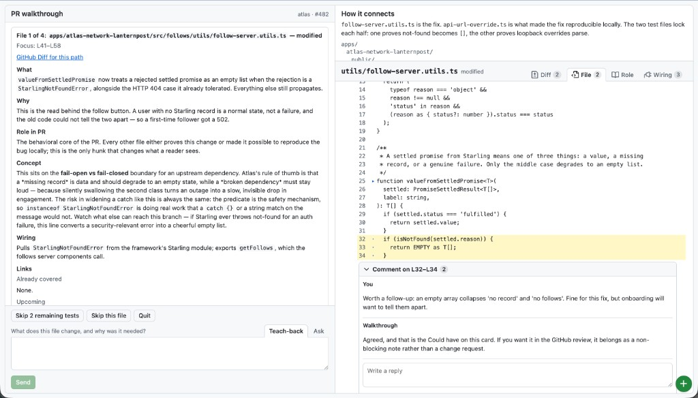
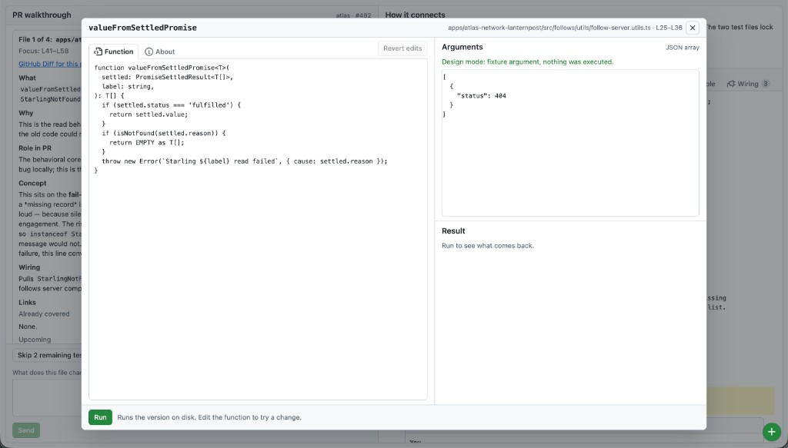

# Code review helper

Code reviewers should actually understand a change set before they put their name on the approval. This project makes that easier by opening pull requests as a file-by-file PR walkthrough with a teach-back gate.

This repo has two surfaces that share the same rough workflow:

- A **local app** (`npm run dev`) that expands on the skill: the host owns the gates (dirty tree, large PR, one file, teach-back) and adds a dedicated UI (map, file/diff, inline notes, function sandbox, opt-in chase). The agent still writes the cards.
- A **Cursor skill** (`SKILL.md`) you can run in the IDE (or paste into another coding agent).

The local app is the primary tool. The skill is a lighter, portable copy of the same walk — easier to grab, without the UI, private notes, or host-owned chase insert. This project was built and tested in [Cursor](https://cursor.com). The skill should work in any coding agent with git access. The app drives a **local Cursor agent** via `@cursor/sdk` (usage bills to your Cursor API key).





This project is intended mainly as personal software and as such may incorporate some of my own ideosyncracies — if you try it out and it doesn’t work for you, it will probably require some tweaks to accommodate your personal workflow. 

## Motivation

Code reviews are perhaps the most challenging part of modern software engineering. Reviewing well forces you to spend your time and energy understanding something you didn't write yourself, solving a problem you may not fully understand. That's difficult to do, and if you're anything like me you might let your eyes glaze over or flail around blindly for a segment of code you do understand. Not being the reviewer I **should** be has been weighing on me, and with reviews becoming more and more of the job as AI-assisted coding proliferates, I decided I needed a solution.

One possibility was to find a way to automate reviews entirely, but that's an undesirable shortcut: code reviews are how we learn what our colleagues are doing and how the whole system works, **and** how we take responsibility for what’s in the codebase. I've therefore chosen to **force** reviewer attentiveness by building a review assistant that forces me to walk through the PR diff and engage in back-and-forth queries until the system is satisfied that I know how each file works, the motivations behind the structure, and how the PR connects as a whole. This is, perversely, AI tooling that makes everything take longer — but the outcome is better code, an honest thumbs-up, and, on my end, a better engineer.

It has not escaped my notice that this tooling can also be used to interrogate my own drafted pull requests.

## Design principles

**What a code review is for.** A review is not mainly a lint pass or a merge gate with a comment box. It is how a team shares context, catches mistakes before they land, and takes shared responsibility for what ships. The reviewer should be able to explain the change — what it does, why it exists, how it fits the rest of the system — well enough to stand behind an approval or a targeted request for changes.

**Code is connected.** A diff line in isolation rarely tells the story. Changes propagate through call chains, imports and exports, shared types, config, and the PR’s stated goal. Good review is systems thinking: how this file serves the whole change, who calls what, what broke if this assumption is wrong. Tools should foreground that connectivity — map before file-by-file, role in the PR, wiring between paths — not encourage file-at-a-time amnesia.

**Amplify, don't replace.** AI tooling is good at shortcuts: summarize diffs, flag patterns, skip to “looks fine.” Shortcuts save time, but they can also train you out of the work that reviews are for. Useful assistants **prepare** (map the change set, order files by dependency, surface how pieces connect, flag evidence-backed risks), **structure** (one file at a time with links back to the queue and the overview), and **support** (answer questions, export notes for the real GitHub review). They should not **substitute** for understanding or for the act of approving.

**Keep the human on the hook.** The model can propose; the reviewer still paraphrases, prioritizes, and signs off. Gates that block “lgtm” without explanation, separation of defect-hunting from the walk, and notes that feed into an official review — all of that keeps AI in a collaborator role rather than an autopilot.

**When in doubt, prefer depth over speed.** Large PRs get a honest size gate, not a silent skim. High-risk diffs stay in the walk even in core-only mode. The goal is a reviewer who is *better* after using the tool, not one who has outsourced judgment to it.

**Two postures, one walk.** On a system I already own, the walk should lean into the seams that actually matter (error isolation, cache invalidation on a website). On a system I am catching up on, that same attention should go to the teachable big picture: what kind of app this is, how data and failures move — not a pile of local trivia. Checkout kind (mobile / website / backend) plus docs like `AGENTS.md` supply a short Watch for list — kind-level questions at the seam, not invented house law. In the app, `user.md` is craft notes about the reviewer; `repos/<origin>.md` is a **map of that checkout** that each walk expands; `general.md` is best-practice commentary you write by hand (walks do not overwrite it). The **Repo** overview block is still stack/docs Watch for.

**Blast radius lives outside the diff.** A bugfix can break callers the PR never touched. The parsed wiring graph stays inside queued + covered files so the walk stays teachable. “No importers in walk scope” means none *in this walk*, not unused in the product. Unchanged callers of a changed contract are still in play: the app can **insert a thin chase card** when you opt in (Wiring tab or a chip) — a few paths after the current file, no chase-on-chase, skip / done looking is enough. The skill offers the same chase in chat. Neither surface auto-queues the rest of the repo.

## Why this shape

GitHub’s diff UI is built for scanning. That is useful for “did anyone typo the config key?” It is a poor teacher. You can approve a PR and still not be able to explain it to a teammate.

So the walkthrough:

1. Checks out the PR locally (clean tree first) so you see the **real files** — clickable, with surrounding context — not only hunks. GitHub/`gh` can still supply metadata; checkout stays the primary path.
2. Gives a **map** first — what happens after merge, why the PR exists, dependencies, how the files connect, **what this repo is** (mobile vs website vs backend, plus Watch for from docs/stack) — then an ordered queue. Not GitHub’s alphabetical dump.
3. Covers **one file per turn**: the **local** file at the changed lines (primary view — clickable, full context). Optionally adds a GitHub **Diff** link for that path’s hunks only (`file-filters` + `#diff-…`; never opens the whole Files tab). Then what / why / **role in PR** / **wiring** (imports and exports among queued and covered files) / links / a few evidence-backed watch-outs (“uh ohs”). In the **app**, the right column has **Role** and **Wiring** tabs; Wiring can list outside callers and **Chase** inserts a thin card after this file. In the **skill**, chase is an opt-in chat move with the same thin card shape. Complex or novel hotspots that are central to the change get a **Look closer** callout with **name + line range** (especially on big files) so you can find them; naming them in teach-back is a plus, not a hard gate when the file-level explanation is solid. On interlocking files, there may be a short **Map** of how those pieces connect. On files with a real, evidenced design fork, **Could have** names a plausible alternative and tradeoff (counterfactual review, not a teach-back gate). Uh ohs are the highest-leverage risks implied by *this* file, not a tour of every review dimension.
4. **Will not advance** on “next”, “lgtm”, or a nod. You explain the file in your own words. Wrong or thin: it corrects **one** beat and stays put — not a quiz of every internal. Later files **credit** earlier paraphrases: if you already explained a boolean or contract, a test or caller of that helper does not have to recite it again. A question is answered without counting as teach-back (in the app, switch to **Ask**). Skip exists if you are stuck. **Skip remaining tests** (chip or “skip the string-change files”) drops leftover test/spec paths without a per-file one-liner. Chase cards do not require a paraphrase — skip or **Done looking** is enough. Teach-back is what / why well enough to tell a teammate. It does not quiz you on Could have, uh ohs, or a review checklist. Map is not a separate gate.
5. At the end you summarise the whole PR. It does not recap the opening for you to parrot. Name the shared gate if you have not already; the walk counts — wrap-up will not re-quiz beats you already said, or invent a new stay after you fill one. Mention call-site divergence **if this PR has it**. Design forks from the walk are collected in wrap-up if any came up. In the app, **Copy review notes** gathers uh-ohs and your inline notes for the GitHub review where your approval actually lands. Then it offers to restore the branch you were on when the walk started (not necessarily `main`).

Review texture (contracts, risk, size, counterfactuals) lives in those existing buckets when the file actually has it. The overview / large-PR gate is where size and split-worthiness show up. Tests, ops, and rollout belong in a later defect pass unless they *are* the reason something is in Look closer or Uh oh. In the **skill**, optional GitHub **Viewed** flags can quiet the PR file tree; they are not a substitute for checkout. The app does not set Viewed flags.

Uh ohs are not a bot review. They are “look at this if you are going to thumbs-up.”

**It teaches the systems, not just the diff.** The walk detects which architectural systems this checkout actually runs on — shared cache tier, CDN/surrogate ownership, server render cache, client query keys, feature flags, shared-package contracts, device storage, native permissions, job idempotency, migrations, error-reporting ownership — and when a hunk lands on one of those seams the card adds a short **Concept** beat: what the strategy is *here*, what it buys, and how it usually breaks. That is the context a staff engineer already carries; reviewing a Duet PR should leave you knowing how Duet caches, and a mobile PR should leave you knowing what happens when the OS says no. It is teaching, so it is never a teach-back gate and never appears on files that only brush the system.

**And the teaching adapts to you.** How deep that Concept beat goes depends on what earlier walks already taught you and what you engaged with in your own words — see [What it remembers](#what-it-remembers).

## Requirements

You need a **local clone** of the repo under review and a **clean working tree** there. Checkout is the walk. GitHub-in-the-browser is not enough.

Both surfaces need:

- `git`
- ideally [GitHub CLI](https://cli.github.com/) (`gh`), authenticated (`gh auth login`) so `gh pr checkout` works. Without `gh`, checkout falls back to `git fetch origin pull/<n>/head`.

**Skill** (Cursor, Claude Code, Codex, …): no Node install. The agent that is already running does the walk. It uses *that* product’s account, not this repo’s `.env`.

**Local app** (browser UI): you do **not** need the Cursor IDE. You **do** need:

- [Node.js](https://nodejs.org/) 20+ and npm
- a [Cursor API key](https://cursor.com/dashboard/api) — cards, teach-back, Q&A, and private-note rewrites go through `@cursor/sdk` and bill to that key
- macOS or Linux (Windows is untested)

The app never logs into the Cursor desktop app. A key in `.env` is the whole link.

## Skill (any coding agent)

In **Cursor**, clone into the personal skills directory so every repo you open can see it:

```bash
git clone git@github.com:grahammacaree/code-review-helper.git ~/.cursor/skills/pr-file-walkthrough
```

HTTPS: `https://github.com/grahammacaree/code-review-helper.git`. If that folder already exists, it *is* this project — pull instead of cloning. `SKILL.md` lives at the repo root, so Cursor still discovers the skill even though the repo also contains the app.

Paste a PR URL or say **walk me through this PR** / **pr-file-walkthrough**. Dirty tree? Switch or stash first; the skill will not checkout over your work. Having GitHub connected in the IDE does **not** skip checkout. Then say **start** after the overview.

In **Claude Code, Codex, or similar**: you are already in an agent. Copy `SKILL.md` and `templates.md` into project instructions, or `@`-include them when you review. Open the PR’s clone as the workspace. Same gates: clean tree, checkout, overview, one file, teach-back. You will not get the two-column UI, private `data/commentary/` notes, or the app’s Chase insert — those are app-only. The agent’s own backend is what you pay.

If the PR is large (≥ 20 files or ≥ 1500 lines of real churn, ignoring lockfiles/generated/images), the walk stops and asks **quit**, **core only** (about 8 load-bearing files, plus any other changed files whose diffs look high-risk — the queue may grow), or **walk all**. That is for AI-sized diffs: forcing every generated file would recreate the glaze. Core-only is not a shortcut past understanding the spine or past obvious foot-guns. When you finish or quit, it offers to put you back on the branch you started from.

New SVGs, jpgs, and other pure assets are listed once and skipped. No teach-back on “what is an SVG.”

The host opens the checked-out file beside the chat when it can — that is the primary surface. On a GitHub PR, each card may also link **that path’s** Diff for hunks (not the whole Files tab). Teach-back and gates still work if the host cannot open files; checkout still happens so disk matches the PR.

## Local app

The app is a dedicated two-column UI for the same walkthrough. Clone this repo somewhere you keep projects — not into `~/.cursor/skills/` unless you also want the skill from that copy.

```bash
git clone git@github.com:grahammacaree/code-review-helper.git
cd code-review-helper
cp .env.example .env
```

Put a user key from [Cursor Dashboard → API Keys](https://cursor.com/dashboard/api) in `.env` as `CURSOR_API_KEY`. Optional: `CURSOR_MODEL` (default `composer-2.5`), `PORT` (default `8787`).

```bash
npm install
npm run dev
```

Wait until the terminal shows the walkthrough API on port 8787. Vite can proxy `/api` before the API is listening; a refresh after that line is enough.

- UI: [http://127.0.0.1:5173](http://127.0.0.1:5173)
- API: [http://127.0.0.1:8787](http://127.0.0.1:8787)

In the form: path to the **other** repo (the PR’s clone), plus a PR URL or number. The app checks out the PR tip there (clean tree first). Explain files in the box; **Ask** vs teach-back is a mode switch. **Skip remaining tests** drops leftover test/spec files when the rest of the queue is bookkeeping. **New walkthrough** starts a new session.

If the API key is missing, `/api/auth` reports it and cards will not generate. If checkout fails, `gh` is usually not installed or not logged in. Do not expose 5173/8787 off localhost (see Data and security).

Walks persist across refresh and server restart (`data/sessions/`, gitignored; the browser remembers the session id). **New walkthrough** starts a new session; it does not wipe commentary.

Each file card includes **Role in PR** (agent) and **Wiring** (parsed imports/exports among queued and covered files — “no importers in walk scope” means none *in this walk*, not unused in the product); the right column exposes the same as **Role** and **Wiring** tabs beside **File** and **Diff**. If an unchanged file still imports a changed export, Wiring (and a chip) can **Chase** it: up to three thin cards inserted after the current file (finish this file first), no chase-on-chase, skip / done looking instead of teach-back. Checkout is what lets you click through to those callers. At wrap-up (and when done), the last file stays open and you can **click files in the map** to reopen Diff / File / Role / Wiring while writing the summary. **Copy review notes** puts lingering uh-ohs, design forks, and your inline questions/comments on the clipboard as Markdown for pasting into a GitHub review.

### Design mode

`npm run design` opens every UI state on fixtures — no PR, agent, or API key — and `npm run design:check` renders them all headlessly so a broken state fails loudly. It mounts the same `WalkView` the app does, so the design you review is the design you get; the fixture repo is invented, which is why screenshots taken here are safe to publish. Add a state in `web/src/design/fixtures.ts`.

## Function sandbox

Reading a function tells you what it is supposed to do. Running it tells you what it does — which is the difference between believing a reviewer's explanation of a boolean and watching the boolean come back false.

Clicking the ▸ beside a function header in the app opens the sandbox, a near-fullscreen modal where both the function and its arguments are editable: Run (or ⌘/Ctrl+Enter) executes what is on screen. An edited function runs from a scratch copy of the whole file written beside the original — so its imports still resolve — and that copy is always deleted afterwards; your working tree is never modified.

**Arguments are inferred, not demanded.** The box is filled by working down a ladder, and the note above it says which rung it landed on: a Jest/spec call, a typed fixture (`const foo: Type = { … }`) or fixture builder, a real call site in ordinary source, and finally the parameter types themselves — interfaces, type aliases, enums and inline object types are followed through relative imports and turned into objects with their required fields filled. Only when a type says nothing do you get a bare placeholder.

**The About tab explains the function, not the diff:** what it does, why it exists and who calls it, the repo system it participates in (taught at the depth your earlier walks earned), and one caution about editing it — over a list of facts parsed from the checkout (signature, the comment above it, whether it is exported, the imports its body uses, every caller with test and changed-in-this-PR marked, and whether the PR touches its lines). It costs an agent round trip, so nothing is fetched until you open the tab, and the answer is cached per function; **Ask again** puts the question afresh rather than replaying the cache.

## What it remembers

A walk that starts from zero every time has to re-teach you things you already know, and cannot notice the ones you never picked up. So after a walk the app (not the skill) rewrites **private notes** under `data/commentary/` in *this* project — never the tree you are reviewing:

- `user.md` — portable craft (how you review). Habits, not a walk log.
- `repos/<origin>.md` — a living map of that checkout (how the system works, seams to look at). Each walk merges in; it is not a PR changelog.
- `general.md` — best-practice commentary you write yourself. Walks do not overwrite it. Edit the file under `data/commentary/general.md`.
- `concepts.json` — per-system exposure ledger (taught count, engaged count, last seen, which checkouts). Counts, not prose; safe to delete if you want to start teaching from scratch.

**The ledger sets the pitch of the teaching.** Each architectural system is tracked not just by how many walks have taught it, but by whether you engaged it in your own words rather than only reading it. The first time a system comes up the card scaffolds from scratch and glosses the vocabulary; once you have it, the card skips the primer and adds a dimension you have not been shown; once you are fluent it goes straight to the tradeoff this repo chose and what it costs. A system you have not seen in months steps back down a level, so stale knowledge gets re-grounded instead of assumed. The walk never mentions any of this — it changes the pitch, not the conversation.

These files feed later **cards** (uh-ohs / Look closer) and are agent-only: none of it is shown on the opening overview. The **Repo** overview block is stack/docs Watch for (mobile vs website vs backend, `AGENTS.md` / contributing bullets), not private notes and not a detector of whether you already own the system.

## Data and security

This is personal local software, not a hosted product. Treat it that way.

**On this machine.** The Cursor API key lives in `.env` (gitignored). Walk state lives under `data/` in *this* project (also gitignored): `data/sessions/` holds card text, teach-back, inline notes, and PR metadata as JSON; `data/commentary/` holds craft notes (`user.md`), a living map of each checkout (`repos/<origin>.md`), hand-edited best-practice notes (`general.md`), and a per-system exposure ledger (`concepts.json`). Those commentary files are for the agent, not the overview UI. Full file blobs are not written to those session files — the host re-reads the worktree when you resume. The browser keeps a session id and recent clone paths in `localStorage`. None of that is encrypted at rest.

**Not in the repo under review.** Checkout switches that clone to the PR tip (and can stash if you confirm). The app does not commit, push, or write notes into that tree. Private commentary is the reason: a public repo should not get a file that maps that checkout or says what you still miss.

**Off this machine.** Card generation, teach-back grading, Q&A, and commentary rewrites go through the **Cursor API**. That includes diffs, excerpts, PR title/body, and slices of your private notes when they exist. Usage bills to your key. The **skill** is whatever agent is running in the IDE: it sees the workspace you opened and talks to that agent’s backend; it does not use this app’s `data/` folder.

**The local HTTP API.** UI and API bind to `127.0.0.1`. There is no login. Anyone who can reach those ports on your machine can drive a session, including the function sandbox (which **runs code from the reviewed tree**, and any edit you type, in a scratch harness). Do not expose 5173/8787 to the network.

**GitHub.** The app does not post review comments. The skill stays read-only unless you explicitly ask it to comment. Optional Viewed flags in the skill are navigation only.

Delete `data/` and `.env` if you want a clean slate. `New walkthrough` starts a new session; it does not wipe commentary.

## What it is not

- Not a replacement for GitHub review comments. The **skill** stays read-only unless you explicitly ask it to comment. The **app** does not post GitHub review comments.
- Not Bugbot / an automated bug finder.
- Not a ship checklist for your own diffs, and not a full code-review rubric on every file.
- The app does not edit or commit in the repo under review, or piggyback on the Cursor app session. Private walkthrough notes stay in this app’s `data/` folder.

## Files


| Path                                | Role                                                                                                                 |
| ----------------------------------- | -------------------------------------------------------------------------------------------------------------------- |
| `SKILL.md`                          | Agent instructions (Cursor skill format; usable elsewhere)                                                           |
| `templates.md`                      | Output shapes (overview, file card, teach-back, wrap-up)                                                             |
| `server/`                           | Walkthrough host (checkout, gates, agent, function sandbox)                                                            |
| `server/probe.ts`                   | Finds the function under the cursor; runs it — or your sandbox edit — in a scratch harness                            |
| `server/samples.ts`                 | The argument ladder: test calls, typed fixtures, fixture builders, real call sites                                    |
| `server/shapes.ts`                  | Last rung of that ladder: builds a value from the parameter's own type, following local imports                       |
| `server/wiring.ts`                  | Import/export graph among **walk** files; `findOutsideImporters` for opt-in chase                                    |
| `server/repoLens.ts`                | Checkout kind + doc/stack Watch for (overview + uh-oh bias)                                                          |
| `server/concepts.ts`                | Which architectural systems this checkout runs on + the staff-level framing taught when a hunk hits that seam         |
| `server/conceptMemory.ts`           | Per-system exposure ledger; picks scaffold / build / deepen for the Concept beat                                      |
| `server/commentary.ts`              | Private notes: craft, checkout map, hand-edited `general.md`; agent-only, not shown on overview                       |
| `web/`                              | Local UI                                                                                                             |
| `web/src/components/RolePane.tsx`   | **Role** tab — PR motivation + file role                                                                             |
| `web/src/components/WiringPane.tsx` | **Wiring** tab — walk-scope graph plus Chase on outside callers                                                      |
| `web/src/components/Sandbox.tsx`    | Function sandbox modal: editable source and arguments, plus the **About** brief                                       |
| `web/src/components/NoteThread.tsx` | Inline review threads anchored in the code (comments, Look closer, uh ohs)                                           |
| `web/src/components/Octicon.tsx`    | Inlined Octicon (MIT) 16px paths used by the tab bar                                                                 |
| `web/src/components/WalkView.tsx`   | The two-column walk surface; owns pane state only, so app and design mode cannot drift                                |
| `web/src/design/`                   | Design mode: fixture states (`fixtures.ts`), the switcher (`DesignMode.tsx`), headless check (`smoke.tsx`)            |


In Cursor the skill id is `pr-file-walkthrough` so existing triggers keep working. This repo is named `code-review-helper`.

## License

MIT. See [LICENSE](LICENSE).

The tab bar icons are [Octicons](https://github.com/primer/octicons) (© GitHub, MIT), inlined as path data in `web/src/components/Octicon.tsx`.
